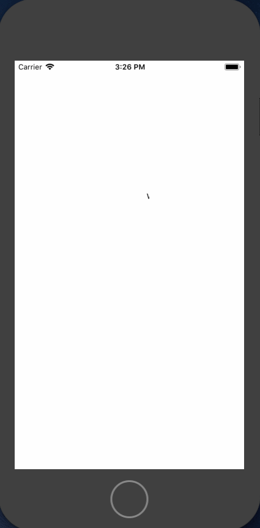
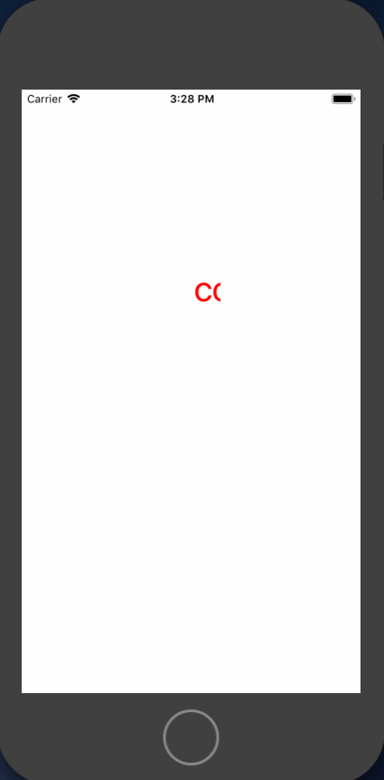

# KZCaptionView

Only a single line of code to add a caption view.
It supports change textColor, font and speed (step).
It has a default speed 80 (pt/s). 
You're probably curious how it looks. Here's some shots from the example app:





##中文介绍

一行代码添加滚动字幕
字幕会在视图内部匀速滚动
可以设置字幕颜色，字体，步长

###1.快速初始化添加滚动字幕
```
//  ViewController.m
self.kzView = [[KZCaptionView alloc] initWithFrame:CGRectMake(20, 180, 200, 80) text:@"welcome"];
[self.view addSubview:self.kzView];
```

###2.自定义颜色字体

```
//  ViewController.m
KZCaptionView *kzView = [[KZCaptionView alloc] initWithFrame:CGRectMake(20, 180, 200, 80)];
[self.view addSubview:kzView];
[kzView setText:@"cool" textColor:[UIColor redColor] font:[UIFont systemFontOfSize:40]];
```

###2.自定义步长 ( 每秒移动的 point )

```
//  ViewController.m
KZCaptionView *kzView = [[KZCaptionView alloc] initWithFrame:CGRectMake(20, 180, 200, 80)];
[self.view addSubview:kzView];
kzView.step = 20;	//默认为80
[kzView setText:@"cool" textColor:[UIColor redColor] font:[UIFont systemFontOfSize:40]];
```

有任何问题，和改进意见可以提 issue 给我，或者通过邮件联系，谢谢


